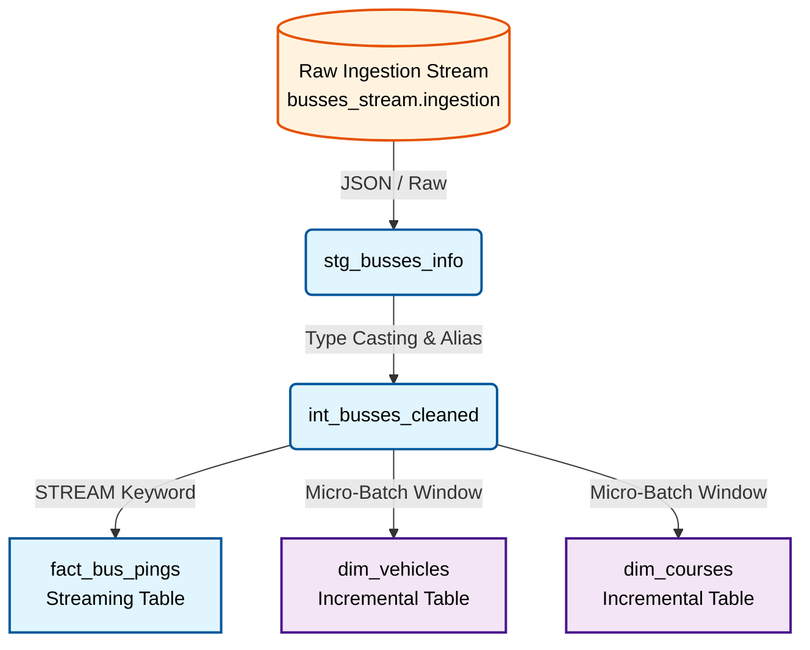

# Busses Streaming Data Pipeline

## Table of Contents
- [Project Description](#project-description)
- [Micro-Batching & Streaming Architecture](#micro-batching--streaming-architecture)
- [Workflow Graph](#workflow-graph)
- [Project Setup](#project-setup)

## Project Description

This project processes real-time public transit telemetry data (bus locations, delays, and routes) using **dbt** running on **Databricks**. It transforms raw ingestion streams into an analytically ready Star Schema, allowing stakeholders to track bus movements continuously and monitor operational state. 

The pipeline guarantees near real-time latency while ensuring data quality and deduplication across a continuous stream of events.

## Micro-Batching & Streaming Architecture

This project leverages modern streaming and micro-batching concepts natively supported by Databricks (`dbt-databricks` / `dbt-fusion`).

1. **Pure Streaming Views (`stg_busses_info`, `int_busses_cleaned`)**
   The upstream layers act as pure, stateless streams. They rely solely on `SELECT`, `WHERE`, and basic casting. We intentionally avoid CTEs and Window Functions (like `row_number()`) here so that Databricks can read them as an uninterrupted continuous event log.
   
2. **Streaming Fact Table (`fact_bus_pings`)**
   Configured explicitly as a `streaming_table`, this model reads from the `STREAM(ref('int_busses_cleaned'))`. It represents an **append-only** log of every single valid ping emitted by the buses. This guarantees high-throughput ingestion without the overhead of batch recalculations.
   
3. **Stateful Incremental Dimensions (`dim_vehicles`, `dim_courses`)**
   To maintain the *latest* known state of a vehicle or course, we utilize standard `incremental` models configured with a `unique_key`. During every micro-batch interval, dbt identifies the latest ping using window functions (`row_number() over (partition by ... order by ping_at desc)`) and executes a `MERGE` (Upsert) operation against the target dimension tables. This seamlessly deduplicates events and keeps the dimensions strictly synced with the latest facts without requiring a full refresh.

## Workflow Graph

The following diagram illustrates the flow of data from ingestion to our analytical Star Schema:



## Project Setup

Follow these steps to configure and run the project locally against your Databricks workspace.

1. **Install Dependencies**  
   Ensure you have the Databricks adapter for dbt installed in your environment:
   ```bash
   pip install dbt-databricks
   ```

2. **Configure profiles.yml**  
   Update your `~/.dbt/profiles.yml` file to include the `busses_streaming` profile. Ensure you provide a valid Databricks Personal Access Token (`token`).
   ```yaml
   busses_streaming:
     outputs:
       dev:
         type: databricks
         catalog: busses_stream
         schema: dbt_schema
         host: dbc-f61dda53-b604.cloud.databricks.com
         http_path: /sql/1.0/warehouses/d93742c1872d4010
         threads: 1
         token: <YOUR_DATABRICKS_TOKEN>
     target: dev
   ```

3. **Verify Connection**  
   Validate that dbt can authenticate with your Databricks cluster:
   ```bash
   dbt debug
   ```

4. **Run the Pipeline**  
   Once the connection is successful, you can compile and run the streaming models:
   ```bash
   dbt compile
   dbt run
   ```

